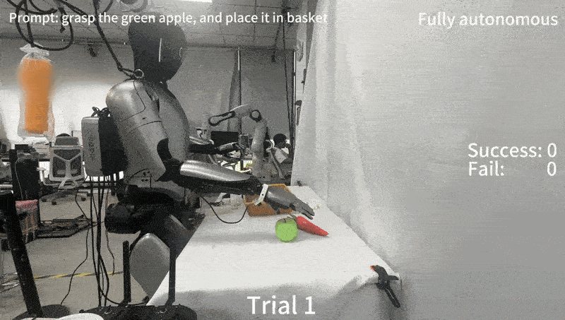

-----

# Magicbot Gen1 Pi0 Project

English | [中文](https://github.com/MagiclabRobotics/magicbot-gen1_pi0_demo/blob/main/README_zh-CN.md)

## 0. 🤖 Introduction

This repository provides the official implementation of **pi0 open-sourse VLA model** for **dual-arm dexterous manipulation** on the Magicbot-Gen1 humanoid robot, covering whole workflow including data preprocessing and model training. For more information about the model, please refer to [pi0 official guide](https://github.com/Physical-Intelligence/openpi/tree/main) .

<div align="center">
  
</div>

-----

### Table of Contents

- [Magicbot Gen1 Pi0 Project](#magicbot-gen1-pi0-project)
  - [0. 🤖 Introduction](#0--introduction)
    - [Table of Contents](#table-of-contents)
  - [1. 🛠️ Installation](#1-️-installation)
  - [2. 📊 Data Collection](#2--data-collection)
  - [3. 💾 Data Preprocessing \& Storage Convention](#3--data-preprocessing--storage-convention)
    - [3.1: Data Storage Convention](#31-data-storage-convention)
    - [3.2: Convert `.hdf5` to LeRobot Format](#32-convert-hdf5-to-lerobot-format)
  - [4. 🚀 Training Pipeline](#4--training-pipeline)
    - [4.1: Environment Setup](#41-environment-setup)
    - [4.2: Compute Normalization Statistics](#42-compute-normalization-statistics)
    - [4.3: Start Model Training](#43-start-model-training)
  - [5. 📊 Evaluation](#5--evaluation)
  - [6. 🤝 Contributing](#6--contributing)
  - [7. 🤔 Troubleshooting](#7--troubleshooting)
  - [8. 📄 Acknowledgement](#8--acknowledgement)


## 1. 🛠️ Installation

This repository has been tested with Ubuntu 22.04. Follow these steps to set up your development environment:


1.  **Clone the Repository**

    ```bash
    git clone git@github.com:MagiclabRobotics/magicbot-gen1_pi0_demo.git
    cd magicbot-gen1_pi0_demo
    ```


2.  **Manage Python Dependencies with `uv`**
    We use `uv` to manage our Python environment. If you don't have it installed yet, please refer to the [official uv installation guide](https://www.google.com/search?q=https://github.com/astral-sh/uv%23installation).

    Once `uv` is installed, create and sync the virtual environment:

    ```bash
    # NOTE: GIT_LFS_SKIP_SMUDGE=1 is essential for correctly pulling the LeRobot dependency.
    GIT_LFS_SKIP_SMUDGE=1 uv sync
    GIT_LFS_SKIP_SMUDGE=1 uv pip install -e .
    ```


## 2. 📊 Data Collection

Please refer to our open-source teleoperation project [pico_teleoperate](https://github.com/MagiclabRobotics/pico_teleoperate) to collect your own data on Magiclab Gen1 robot with PICO VR headset.

## 3. 💾 Data Preprocessing & Storage Convention 


### 3.1: Data Storage Convention
For optimal flexibility and portability, all data related to this Pi0 humanoid project—including HDF5 files, LeRobot datasets, normalization statistics, and checkpoints—are recommanded to store in a custom centralized location (`PI0_DATA_ROOT`).

Please designate a directory on a storage volume with large capacity as your `PI0_DATA_ROOT`. Subsequently, create the necessary sub-directories in accordance with the recommended structure outlined below.:

```
$PI0_DATA_ROOT/
├── hdf5_data/
│   └── {repo_id}/                    # Converted HDF5 format data
├── lerobot_data/
│   └── {repo_id}/                    # LeRobot dataset format
├── norm_stats_data/
│   └── {repo_id}/                    # Normalization statistics
└── checkpoints/
    └── {exp_name}/                   # Training checkpoints 
```


### 3.2: Convert `.hdf5` to LeRobot Format

This step uses the `examples/libero/convert_magiclab_humanoid_data_to_lerobot.py` script to transform the HDF5 datasets into the LeRobot v2.0 format, which is optimized for training.

**How to Run:**

1.  After collection of your own dataset, place your raw `.hdf5` files into a folder under the sub-directory `hdf5_data/` you create in above step. The name of this folder will serve as the `{repo_id}` for this dataset.
2.  Open the script `examples/libero/convert_magiclab_humanoid_data_to_lerobot.py`.
3.  Modify the `INPUT_PATH`, `OUTPUT_PATH`, and `PROMPT` variables to match your custom hdf5_data folder path, lerobot_data folder path, and task language instruction.
4.  Execute the script from your terminal:
    ```bash
    uv run examples/libero/convert_magiclab_humanoid_data_to_lerobot.py
    ```


## 4. 🚀 Training Pipeline

This section will guide you through the complete process, from raw data to a trained model.

### 4.1: Environment Setup

First, activate your virtual environment and configure the `PYTHONPATH`:

```bash
# Activate the virtual environment
source .venv/bin/activate

# Add the current project directory to PYTHONPATH
export PYTHONPATH="$PYTHONPATH:$PWD"
```

Next, check the available GPUs and specify the device ID(s) you wish to use:

```bash
nvidia-smi
export CUDA_VISIBLE_DEVICES=0 # Replace '0' with your target GPU ID(s)
```


### 4.2: Compute Normalization Statistics

This step uses the `scripts/compute_norm_stats.py` script to calculate the mean and standard deviation for the `state` and `actions` keys across a dataset.

**How to Configure and Run:**

1.  **Set the Input Path and Dataset**:

      * Open the file in your virtual enviriment at `.venv/lib/python3.11/site-packages/lerobot/common/datasets/lerobot_dataset.py`.
      * Replace lerobot default path`LEROBOT_HOME = Path(os.getenv("LEROBOT_HOME", "/your/own/lerobot_data/path")).expanduser()"` with your own path to store lerobot data.
      * Open the configuration file at `src/openpi/training/config.py`.
      * Set `PI0_DATA_ROOT: str = "/path/to/your/PI0_DATA_ROOT/"` to your own path.
      * Locate the `TrainConfig` you intend to use (e.g.,`pi0_magiclab_low_mem_finetune`).
      * In the `data` section, set the `repo_id` attribute to your target dataset name (the `{repo_id}` you set previously).

2.  **Set the Output Path**:

      * Open the script `scripts/compute_norm_stats.py`.
      * The `OUTPUT_PATH` variable in the script determines the root directory for saving statistics. Set `OUTPUT_PATH = '/path/to/your/PI0_DATA_ROOT/norm_stats_data'` to your own path.
      * The final statistics will be saved in a subdirectory named after your `repo_id`.

3.  **Execute the Script**:

    ```bash
    uv run scripts/compute_norm_stats.py
    ```

### 4.3: Start Model Training


**LORA Fine-tuning**

Use this command to apply Low-Rank Adaptation (LoRA) during training, which is a parameter-efficient fine-tuning method.

```bash
TIMESTAMP=$(date +%Y%m%d_%H%M) && \
XLA_PYTHON_CLIENT_MEM_FRACTION=0.95 uv run scripts/train.py pi0_magiclab_low_mem_finetune \
--exp-name=magiclab_$TIMESTAMP
```

**Full Fine-tuning**

Use this command to perform a full fine-tuning of the model, updating all (or most) of its parameters during training.

```bash
TIMESTAMP=$(date +%Y%m%d_%H%M) && \
uv run scripts/train.py pi0_magiclab_full_finetune \
--exp-name=magiclab_$TIMESTAMP
```

## 5. 📊 Evaluation

To evaluate your trained model checkpoint, run the following example script. It will load the model and start policy server for inference.

```bash
# --policy.config The train config you used in configuration file at `src/openpi/training/config.py` in training 
# --policy.dir   Directory to the trained model checkpoint 
uv run scripts/serve_policy.py policy:checkpoint \
--policy.config=pi0_magiclab_low_mem_finetune \
--policy.dir=/path/to/your/PI0_DATA_ROOT/checkpoints/pi0_magiclab_low_mem_finetune/magiclab_20250627_0309/60000
```

## 6. 🤝 Contributing
We welcome contributions! Please feel free to open issues or submit pull requests.

## 7. 🤔 Troubleshooting

> **💡 Troubleshooting**: If you encounter an `OSError: [Errno 28] No space left on device` error during training, it's typically due to insufficient space in `/tmp` or the default cache directory. Before running the training command, export the following environment variables to redirect caches to a disk with sufficient space:
>
> ```bash
> export TMPDIR=/path/to/large_disk/tmp
> export HF_DATASETS_CACHE=/path/to/large_disk/hf_cache
> export XDG_CACHE_HOME=/path/to/large_disk/base_model_cache
> ```


## 8. 📄 Acknowledgement

This code builds upon following open-source project. 

1. https://github.com/Physical-Intelligence/openpi

-----
