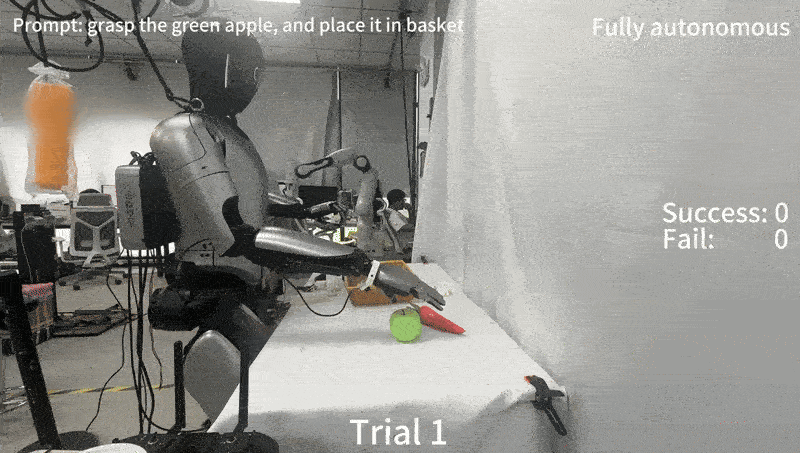

# Magicbot Gen1 Pi0 项目


[English](https://github.com/MagiclabRobotics/magicbot-gen1_pi0_demo/blob/main/README.md) | 中文

## 0. 🤖 项目简介

欢迎来到 Magicbot Gen1 Pi0 项目！

本代码库旨在帮助您在 Magicbot-Gen1 人形机器人上，利用 **pi0 开源 VLA 模型** 实现复杂的**双臂灵巧操作**。我们提供了从数据预处理到模型训练的完整、开箱即用的工作流。

如果希望深入了解 pi0 模型，请移步至 [pi0 官方指南](https://github.com/Physical-Intelligence/openpi/tree/main)。

<div align="center">
  
</div>

-----

### 目录

- [Magicbot Gen1 Pi0 项目](#magicbot-gen1-pi0-项目)
  - [0. 🤖 项目简介](#0--项目简介)
    - [目录](#目录)
  - [1. 🛠️ 环境安装](#1-️-环境安装)
  - [2. 📊 数据采集](#2--数据采集)
  - [3. 💾 数据处理与存储约定](#3--数据处理与存储约定)
    - [3.1: 数据存储约定](#31-数据存储约定)
    - [3.2: 格式转换：从 `.hdf5` 到 LeRobot](#32-格式转换从-hdf5-到-lerobot)
  - [4. 🚀 开始训练](#4--开始训练)
    - [4.1: 配置训练环境](#41-配置训练环境)
    - [4.2: 计算归一化统计量](#42-计算归一化统计量)
    - [4.3: 启动模型训练](#43-启动模型训练)
  - [5. 📊 性能评估](#5--性能评估)
  - [6. 🤝 如何贡献](#6--如何贡献)
  - [7. 🤔 常见问题 (Troubleshooting)](#7--常见问题-troubleshooting)
  - [8. 📄 致谢](#8--致谢)


## 1. 🛠️ 环境安装

在开始之前，请确保您的开发环境符合要求。本项目已在 **Ubuntu 22.04** 环境下完成充分测试。请遵循以下步骤进行安装：

1.  **克隆本代码库 (含子模块)**
    请使用 `--recurse-submodules` 参数以确保所有依赖的子模块都能被正确克隆：

    ```bash
    git clone --recurse-submodules https://github.com/MagiclabRobotics/magicbot-gen1_pi0_demo.git
    cd magicbot-gen1_pi0_demo
    ```

    如果已克隆但忘记添加参数，可以运行以下命令来补全子模块：

    ```bash
    git submodule update --init --recursive
    ```

2.  **使用 `uv` 管理 Python 依赖**
    我们推荐使用 `uv` 来管理 Python 环境，它是一个性能出色的包管理工具。如果尚未安装，请参考其 [官方安装指南](https://github.com/astral-sh/uv#installation)。

    安装 `uv` 后，仅需两步即可完成环境配置：

    ```bash
    # 关键步骤：添加 GIT_LFS_SKIP_SMUDGE=1 是为了确保 LeRobot 依赖能够被正确拉取，请勿省略。
    GIT_LFS_SKIP_SMUDGE=1 uv sync
    GIT_LFS_SKIP_SMUDGE=1 uv pip install -e .
    ```

## 2. 📊 数据采集

数据的质量是模型性能的基石。您可以参考我们另一个关于 Magiclab Gen1 机器人的开源遥操作项目[pico_teleoperate project](https://github.com/MagiclabRobotics/pico_teleoperate)，使用 PICO VR 头显来采集您自己的高质量演示数据。

## 3. 💾 数据处理与存储约定

### 3.1: 数据存储约定
为了方便管理和迁移，我们强烈建议您建立一个统一的数据存储根目录 (`PI0_DATA_ROOT`)，用于存放本项目相关的所有数据，包括：HDF5 文件、LeRobot 数据集、归一化统计数据以及模型检查点。

请指定一个大容量存储卷上的目录作为您的 PI0_DATA_ROOT。随后，请根据如下所述的推荐结构，创建必要的子目录。：
````

$PI0_DATA_ROOT/
├── hdf5_data/
│   └── {repo_id}/                     # 存放转换后的 HDF5 数据
├── lerobot_data/
│   └── {repo_id}/                     # 存放 LeRobot 格式数据集
├── norm_stats_data/
│   └── {repo_id}/                     # 存放归一化统计量
└── checkpoints/
    └── {exp_name}/                    # 存放训练生成的模型检查点

````

### 3.2: 格式转换：从 `.hdf5` 到 LeRobot
此步骤会将 `.hdf5` 文件进一步处理为 LeRobot v2.0 格式，该格式为后续的模型训练流程进行了专门优化。

**操作指南：**

1.  将您采集的原始 `.hdf5` 文件统一存放在上一步骤指定的`hdf5_data/`子路径之下一个文件夹内。该文件夹的名称将作为后续步骤中的数据集标识符 `{repo_id}`。
2.  打开 `examples/libero/convert_magiclab_humanoid_data_to_lerobot.py` 脚本。
3.  根据您的实际情况与数据储存路径选择，修改 `INPUT_PATH`、`OUTPUT_PATH` 和 `PROMPT` (任务的文本指令) 等变量。
4.  执行转换脚本：
    ```bash
    uv run examples/libero/convert_magiclab_humanoid_data_to_lerobot.py
    ```

## 4. 🚀 开始训练

现在，让我们开始激动人心的模型训练之旅！本节将引导您走完从数据准备到模型出炉的全过程。

### 4.1: 配置训练环境

首先，激活虚拟环境并设置 `PYTHONPATH` 环境变量：

```bash
# 激活 Python 虚拟环境
source .venv/bin/activate

# 将当前项目路径添加到 PYTHONPATH
export PYTHONPATH="$PYTHONPATH:$PWD"
````

然后，通过 `nvidia-smi` 查看可用的 GPU，并指定您希望使用的设备 ID：

```bash
# 查看 GPU 状态
nvidia-smi
# 指定使用 GPU 0 (可根据实际情况修改)
export CUDA_VISIBLE_DEVICES=0 
```

### 4.2: 计算归一化统计量

归一化是保证模型稳定训练的关键一步。此步骤将计算数据集中 `state` 和 `actions` 的均值与标准差，为后续训练做准备。

**配置与运行：**

1.  **指定输入路径与数据集**:

      * 打开虚拟环境中的文件 `.venv/lib/python3.11/site-packages/lerobot/common/datasets/lerobot_dataset.py`。
      * 替换原默认lerobot路径 `LEROBOT_HOME = Path(os.getenv("LEROBOT_HOME", "/your/own/lerobot_data/path")).expanduser()` 为您的自定义lerobot数据储存目录。
      * 打开配置文件 `src/openpi/training/config.py`。
      * 将 `PI0_DATA_ROOT` 设置为您的数据根目录。
      * 找到您要使用的 `TrainConfig` (例如 `pi0_magiclab_low_mem_finetune`)。
      * 在 `data` 配置块中，将 `repo_id` 设置为您在前面步骤中创建的数据集名称 `{repo_id}`。

2.  **指定输出路径**:

      * 打开脚本 `scripts/compute_norm_stats.py`。
      * 将 `OUTPUT_PATH` 变量设置为您的归一化数据存储路径 (例如 `/path/to/your/PI0_DATA_ROOT/norm_stats_data`)。
      * 脚本会自动根据 `repo_id` 创建子目录来存放结果。

3.  **执行计算**:

    ```bash
    uv run scripts/compute_norm_stats.py
    ```

### 4.3: 启动模型训练

我们提供两种主流的训练方式：LoRA 微调和全量微调。

**LoRA 微调 (推荐)**
LoRA (Low-Rank Adaptation) 是一种参数高效的微调技术。如果您的计算资源有限，或希望快速进行实验迭代，推荐使用此方法。

```bash
TIMESTAMP=$(date +%Y%m%d_%H%M) && \
XLA_PYTHON_CLIENT_MEM_FRACTION=0.95 uv run scripts/train.py pi0_magiclab_low_mem_finetune \
--exp-name=magiclab_$TIMESTAMP
```

**全量微调**
这将更新模型的所有（或大部分）参数，训练更充分，但需要更多的计算资源和时间。

```bash
TIMESTAMP=$(date +%Y%m%d_%H%M) && \
uv run scripts/train.py pi0_magiclab_full_finetune \
--exp-name=magiclab_$TIMESTAMP
```

## 5\. 📊 性能评估

训练完成后，您可以通过运行以下实例脚本来启动一个策略推理服务，从而在真实机器人上评估模型的性能。

```bash
# --policy.config: 指定训练时使用的配置名称
# --policy.dir:    指定模型检查点（checkpoint）所在的具体路径
uv run scripts/serve_policy.py policy:checkpoint \
--policy.config=pi0_magiclab_low_mem_finetune \
--policy.dir=/path/to/your/PI0_DATA_ROOT/checkpoints/pi0_magiclab_low_mem_finetune/magiclab_20250627_0309/60000
```

## 6\. 🤝 如何贡献

我们是一个开放和欢迎的社区，非常期待您的贡献！无论是提交 Issue 来报告问题、提出改进建议，还是通过 Pull Request 来直接贡献代码，我们都表示衷心的感谢。

## 7\. 🤔 常见问题 (Troubleshooting)

> **💡 提示**：如果在训练时遇到 `OSError: [Errno 28] No space left on device` 错误，这通常意味着您的 `/tmp` 目录或默认的缓存文件夹磁盘空间不足。
>
> 您可以将缓存目录重定向到一个空间更充裕的磁盘来解决此问题，只需在运行训练命令前执行：
>
> ```bash
> export TMPDIR=/path/to/large_disk/tmp
> export HF_DATASETS_CACHE=/path/to/large_disk/hf_cache
> export XDG_CACHE_HOME=/path/to/large_disk/base_model_cache
> ```

## 8\. 📄 致谢

本项目的发展离不开以下优秀开源项目的支持，在此表示感谢：

1.  [openpi](https://github.com/Physical-Intelligence/openpi)

<!-- end list -->
